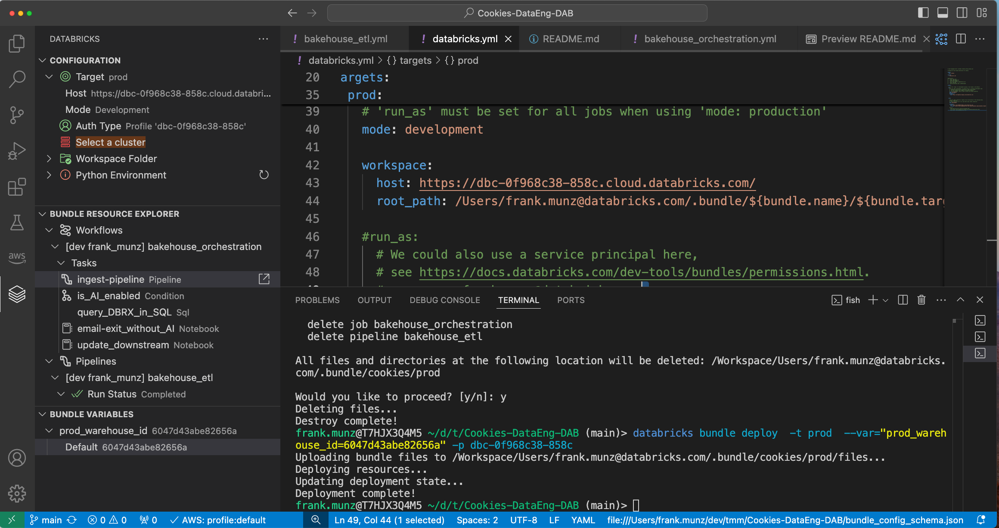
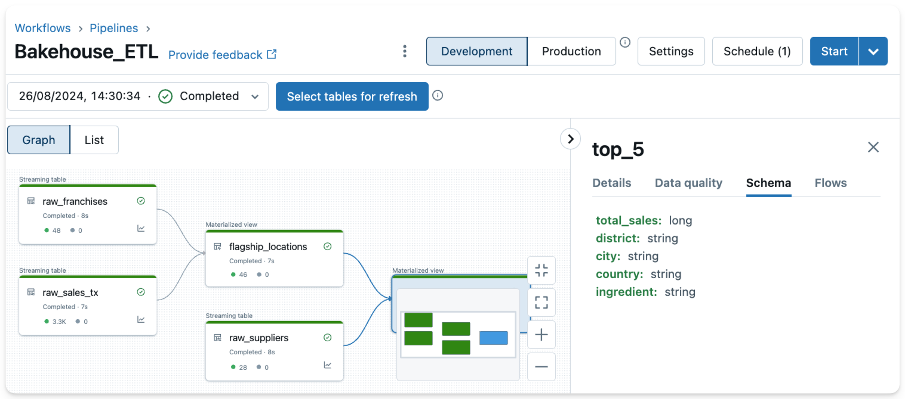

# Databricks Asset Bundles & Marketplace in Action: The Data Engineer's Guide 🍪 🍪 🍪


This project demonstrates advanced Databricks features using the bakehouse dataset from Data+AI Summit 2024. It assumes familiarity with Databricks, its tooling, and core concepts. The dataset is freely available in the [Databricks Marketplace](https://marketplace.databricks.com/details/f8498740-31ea-49f8-9206-1bbf533f3993/Databricks_Cookies-Dataset-DAIS-2024-).

For those interested in the underlying technologies, there's an excellent [introduction to Databricks Workflows and Delta Live Tables](https://www.youtube.com/watch?v=KVCc1Dkz7tM). This video also provides an overview of the bakehouse application, which analyzes streaming data to identify optimal locations for new flagship stores. This repository implements the same application as a Databricks Asset Bundle.


## Getting started

1. Preparations 

* Install the Databricks CLI from https://docs.databricks.com/dev-tools/cli/databricks-cli.html
* Get the Cookies dataset from [Databricks Marketplace](https://marketplace.databricks.com/details/). Make sure to save it with the catalog name ``bakehouse`` (otherwise you have to adjust the code in the DAB accordingly).
* Since the the Cookie dataset in ``bakehouse`` is a read-only share, create another catalog with the name ``bakehouse-active`` for pipeline and result tables using either the workspace UI or SQL. 
* Install developer tools such as the Databricks extension for Visual Studio Code from [here](https://docs.databricks.com/dev-tools/vscode-ext.html). 


2. Authenticate to your Databricks workspace, if you have not done so already:
   
```
   databricks auth login --host <workspace-url>
```

3. Make sure the CLI is configured and the bundle is valid, run the following command from the current folder:       

```
   databricks bundle validate [-p profileName]
```

Depending on the default profile of your CLI setup you might have to add the correct auth profile with [-p profileName].

To deploy the project, you need to reference an existing DWH. If you don't have a DWH, create it now using the Workspace UI and note its ID (here wwwww). 
   
   
Then deploy to your production environment (replace wwwww with your warehouse ID):
   ```
    databricks bundle deploy -t prod --var="prod_warehouse_id=wwwww" [-p profileName]
   ```

This deployment creates:

* A Databricks Workflow with DLT data ingestion and transformation
* A branch task
* A SQL task with ai_query() callout
* Two notebooks

Access these resources through your workspace's **Workflows** or **Delta Live Tables** section.




4. For reference, the bundle was created by importing existing resources. The following commands were used (do not run these as resources are already added): 
   ```
   databricks bundle generate pipeline --existing-pipeline-id pppp
   databricks bundle generate job --existing-job-id jjjj 
   databricks bundle validate 

5. To run a job or pipeline, you can use the "run" command:
   ```
   $ databricks bundle run
   ```

6. The AI/BI dashboard requires manual installation. [import it from here](https://github.com/databricks/tmm/blob/main/Cookies-DataEng-DAB/src/Bakehouse%20Flagship%20Stores%20bundle.lvdash.json) 

7. For detailed documentation on Databricks Asset Bundles and CI/CD, visit the official documentation
   https://docs.databricks.com/dev-tools/bundles/index.html.


