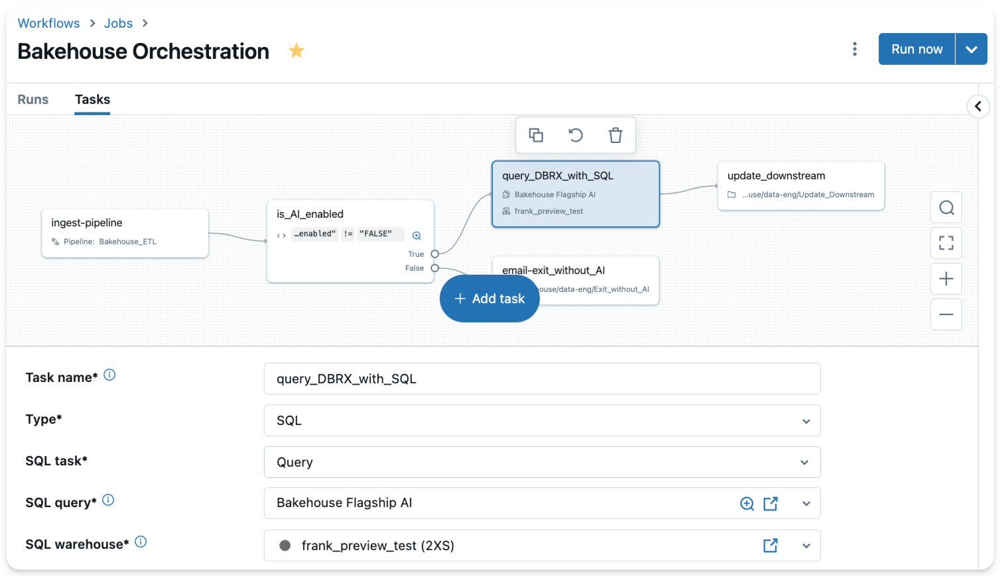
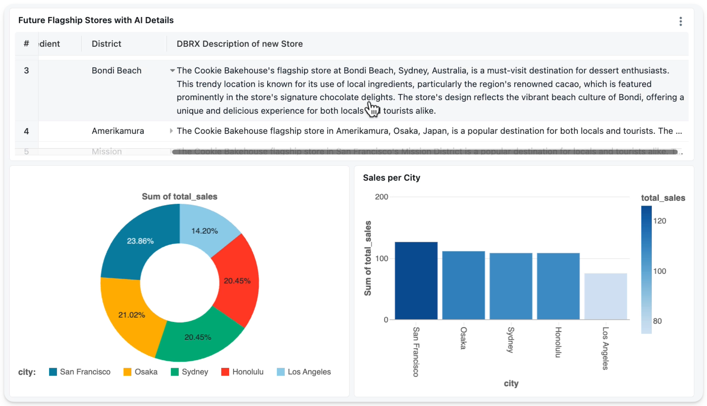

# cookies



The 'cookies' project was generated by using the default-python template. 

This project is using the bakehouse dataset from DAIS which is available for free at the [Databricks Marketplace](https://marketplace.databricks.com/details/f8498740-31ea-49f8-9206-1bbf533f3993/Databricks_Cookies-Dataset-DAIS-2024-) 

An introduction to Databricks Workflows and Delta Live tables which also servers as a greatoverview of the bakehouse application that calculates the top locations for 5 new flagship stores based on streaming data is available at https://www.youtube.com/watch?v=KVCc1Dkz7tM




## Getting started

1. Install the Databricks CLI from https://docs.databricks.com/dev-tools/cli/databricks-cli.html

2. Authenticate to your Databricks workspace, if you have not done so already:
   
   ```
    databricks auth login --host <workspace-url>
   ```

3. Make sure the CLI is configured and the bundle is valid, run the following command from the current folder:         
   ```
    databricks bundle validate
   ```

   To deploy a development copy of this project, make sure you have a running DWH, note its ID (here wwwww) and type:

   ```
    databricks bundle deploy -t prod --var="prod_warehouse_id=wwwww" 
   ```

   This deploys everything that's defined for this project. That's a Databricks Workflow with a task for DLT data ingestion and transformation, a branch task, and SQL task with ai_query() callout and two notebooks. 

   `[dev yourname] cookies_job` to your workspace.
   You can find that job by opening your workpace and clicking on **Workflows**.


4. Note, the bundle was created by importing existing resources. Don't run this now, it's FYI only
   ```
   databricks bundle generate pipeline --existing-pipeline-id pppp
   databricks bundle generate job --existing-job-id jjjj 
   databricks bundle validate 

5. To run a job or pipeline, use the "run" command:
   ```
   $ databricks bundle run
   ```

6. Install developer tools such as the Databricks extension for Visual Studio Code from
   https://docs.databricks.com/dev-tools/vscode-ext.html.

7. For documentation on the Databricks asset bundles format used
   for this project, and for CI/CD configuration, see
   https://docs.databricks.com/dev-tools/bundles/index.html.
