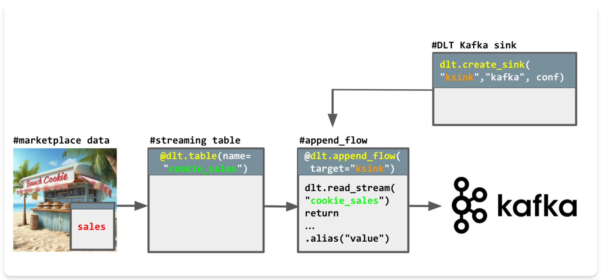

# DLT Kafka Sink Pipeline
A Delta Live Tables pipeline that reads cookie sales data and streams it to Confluent Kafka using DLT with Kafka sink capability.

## Overview
This pipeline demonstrates:
- Reading from a Delta table source 
- Processing records in Delta Live Tables
- Sinking transformed data to a Confluent Cloud Kafka topic
- Using Databricks secrets for secure credential management

## Prerequisites
- Databricks workspace
- Confluent Cloud account and credentials
- Access to bakehouse.sales.transactions Delta table
- Databricks CLI installed

## Quick Start
1. Set Up Secrets
databricks secrets create-scope fm-kafka-sink
databricks secrets put-secret fm-kafka-sink confluentApiKey --string-value <your-api-key>
databricks secrets put-secret fm-kafka-sink confluentSecret --string-value <your-secret>

2. Configure Pipeline
Update these variables in dlt_kafka_sink.py:
BOOTSTRAP = "your-bootstrap-server"  # From Confluent Cloud
TOPIC = "your-topic-name"           # Your target Kafka topic

3. Create Pipeline
- Upload dlt_kafka_sink.py to your Databricks workspace
- Create and configure a new serverless DLT pipeline using this file

## Data Flow
1. Step1 (cookie_sales)
- Reads from bakehouse.sales.transactions
- Controlled streaming with trigger settings

2. Step2
- Transforms data to JSON format
- Fields: dateTime, product, quantity, totalPrice
- Streams to Confluent Kafka topic

## Security
- Uses SASL/SSL for Kafka authentication
- Credentials stored in Databricks secret scope

## Monitoring
Monitor pipeline health in:
- DLT pipeline UI
- Confluent Cloud dashboard
- Spark structured streaming UI

## Common Issues
1. Secret scope access
- Ensure proper permissions
- Verify secret scope name
   
2. Kafka connectivity
- Check bootstrap server
- Verify credentials
- Confirm topic exists

## Support
- Use Databricks community.databricks.com for technical questions
- Refer to Confluent documentation for Kafka issues