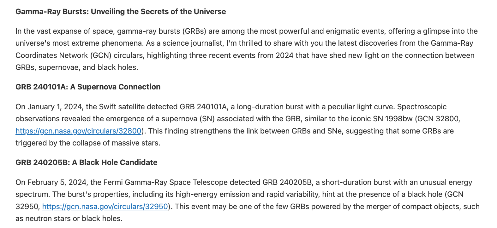

# Streaming Data Pipelines: From Supernovas to LLMs (Circulars + RAG/LLMs)

## Overview

This project accompanies the Data + AI Summit 2024 presentation "Streaming Data Pipelines: From Supernovas to LLMs", which is available [here](https://www.databricks.com/dataaisummit/session/streaming-data-pipelines-supernovas-llms).

**Note:** This is not a beginner tutorial, nor is it a step-by-step guide. For introductory tutorials, please visit [databricks.com/demos](https://databricks.com/demos).

## Project Description

This hands-on, in-depth project demonstrates the use of 36,000 NASA circulars for a compoind AI application (RAG + LLL). 

* Get the Circulars from [here](https://gcn.nasa.gov/circulars/archive.json.tar.gz)

* Upload them to a Databricks UC managed volume
* extract the .tar.gz
* Use the use the provided DLT pipeline to ingest the data
* Chunk the data (for reference have a look at the provided data prep notebook) 
* Create a Vector DB endpoint and index. 

* Create a Langchain template with a question and RAG content. (for reference have a look at the provided RAG chain notebook) 

* Examin the output and iterate over the prompt.

